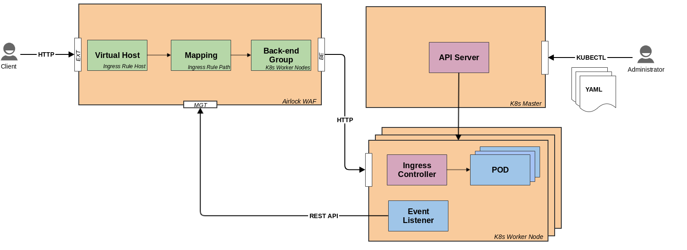

# Introduction
To use Airlock WAF as Reverse Proxy without human interaction in a Kubernetes or OpenShift environment, our recommendations are:
* place Airlock WAF in front of a Kubernetes or OpenShift environment
* use Ingress in case of Kubernetes or Route in case of OpenShift
* listen on Ingress or Route events and create an Airlock WAF configuration via REST API
* use metadata annotations and ConfigMap for parameterization

The demo application listens to Ingress and Route events. It builds and activates a new 
Airlock WAF configuration using the Airlock WAF REST API and lives inside a Pod in a Kubernetes Worker Node.

# Disclaimer
This Proof of Concept application is **NOT** for production use.

# Requirements
* Airlock WAF 7.1 or newer
* Airlock WAF JWT token (API Key)
* Kubernetes or OpenShift
* Airlock WAF and Kubernetes/OpenShift need to be in the same sub network

# Software Architecture Hints
* Based on [Spring Boot](https://spring.io/projects/spring-boot)
* Application Entry Point is in case of
    * Kuberentes: _IngressEventWatcher.java_
    * Openshift: _RouteEventWatcher.java_
* The official Kubernetes [Java Client](https://github.com/kubernetes-client/java) is used to communicate with the API Server
* The OpenShift [Route REST API](https://docs.openshift.com/container-platform/3.7/rest_api/apis-route.openshift.io/v1.Route.html) 
has been implemented in _OpenShiftV1Api.java_
* It uses a client certificate to authenticate against the Kubernetes API Server

# Tutorial
Under examples you will find some tutorials and detail description.